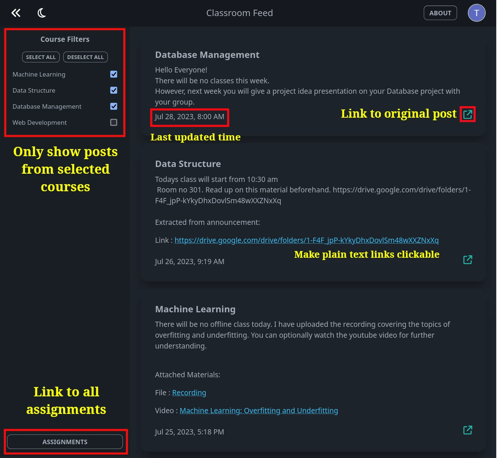

## Introduction

- Glance at the latest announcements from all of your enrolled google classrooms in one place. The announcments are sorted by last updated time. All posts has the link to their original announcement.

- If the announcement contains any plain text urls, the app will extract it and make it a clickable link for convenience. Attached materails like drive folder or youtube video are extracted as well. 

- Installable on mobile as a Progressive Web App



## Tech Stack

The app is built with [SvelteKit](https://kit.svelte.dev/) and [authjs](https://authjs.dev/reference/sveltekit) for authentication.

## Rate Limiting

Implemented with [@upstash/rate-limiter](https://github.com/upstash/ratelimit) using the sliding window algorithm.

## Brief overview of internals

The user first makes a request to `/api/courses` to get a list of all the enrolled google classrooms which has their unique id's. Then for each classroom, the announcements are fetched from `/api/posts/:id` concurrently. The only reason for fetching in the client side is to provide the progressbar to have some indicator for the user. Also there's the added benefit of dynamically populating the feed as announcements from a course is fetched.

The app makes good use of local storage. The fetch's for announcements starts immediately if list of courses is found in the storage but it still fetches the latest course list and only fetch announcement from newly added courses afterwards.

## Development

Install packages

```sh
pnpm install
```

Run vite server

```sh
pnpm dev
```

For generating pwa assets, put the logo as `icons/source.png` or edit `pwa-assets.config.js` to point to a source file and run this command

```
pnpm pwa-assets-generator
```

Make sure to copy those assets in the `static` folder.
